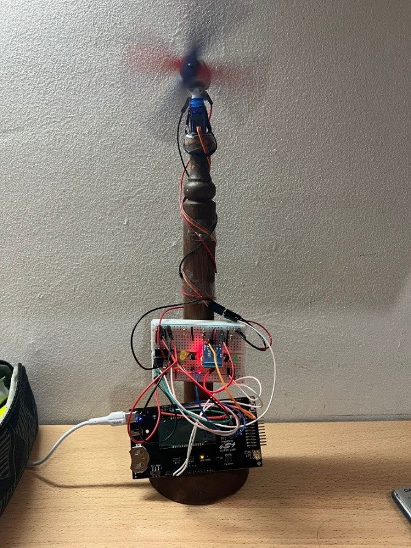

# SmartFanProject

**SmartFan** is an embedded system project developed as part of the Microcontroller course. The system allows for complete control of a fan, including power on/off, speed adjustment, direction control, and angle rotation. The fan can be controlled via push buttons or Bluetooth through a phone app, with all settings displayed on an LCD screen for easy interaction.

## System photo

## Features
- **Power Control (ON/OFF)**: Turn the fan on or off with ease.
- **Speed Adjustment**: 4 levels of fan speed for personalized airflow control.
- **Direction Control**: Adjust the direction of the fan to circulate air in the desired pattern.
- **Angle Rotation (Servo-Controlled)**: Servo motor control for smooth, precise fan rotation.
- **Pushbutton Interface**: Control fan functions with physical push buttons.
- **Bluetooth Control Interface**: Use your phone to send Bluetooth messages for fan control.
- **LCD Display**: Real-time display of current fan settings and status.

## Technologies Used
- Microcontroller EFM32
- Bluetooth HC-04
- DC Motor
- Servo Motor (for motor rotation control)
- Push Buttons
- Embedded C Programming

  
## Functions:
- **Pushbutton 1 (PB1)**: Turns the fan **ON/OFF**.
- **Pushbutton 2 (PB2)**: Adjusts the **fan speed** (4 levels of speed).
- **Pushbutton 3 (PB3)**: Changes the **direction** of the fan (e.g., clockwise or counterclockwise).
- **Pushbutton 4 (PB4)**: Controls the **servo motor rotation angle** (adjusts the fan's rotation angle).
- **Bluetooth**: send 'P' for power, 'S' for speed, 'D' for direction and 'R' for angel rotate.

## Video Demonstration
Check out the video demonstration of the **SmartFan** project here:  
https://drive.google.com/file/d/1nQjAiE5fn6PUWNACbgIPGUTGWU4xyesl/view?usp=drivesdk

